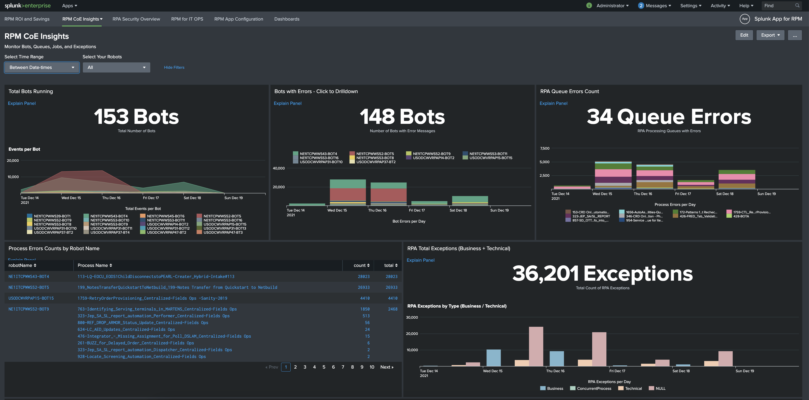
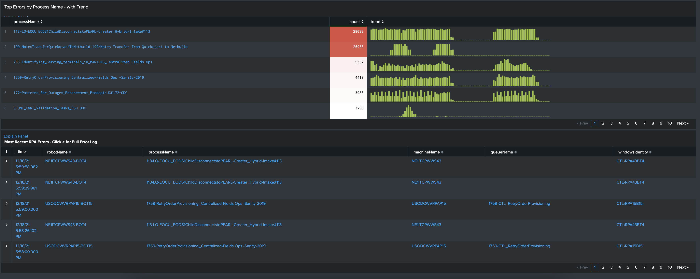
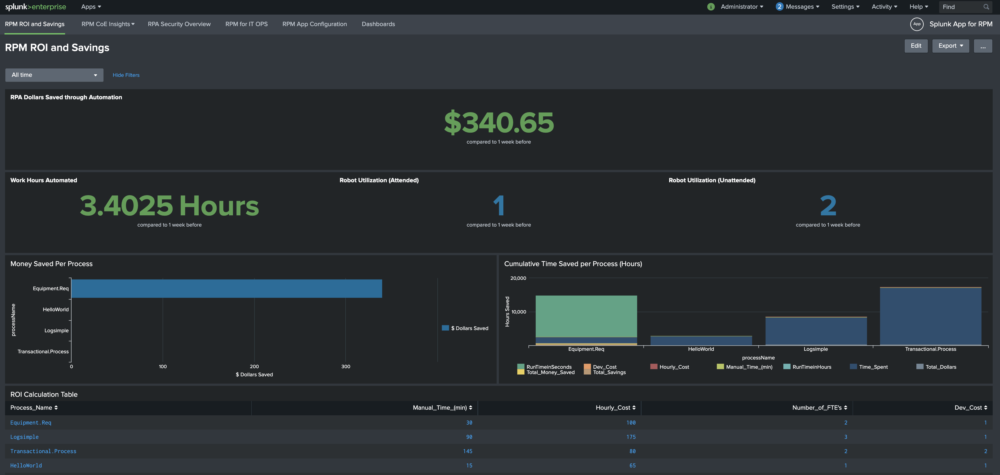
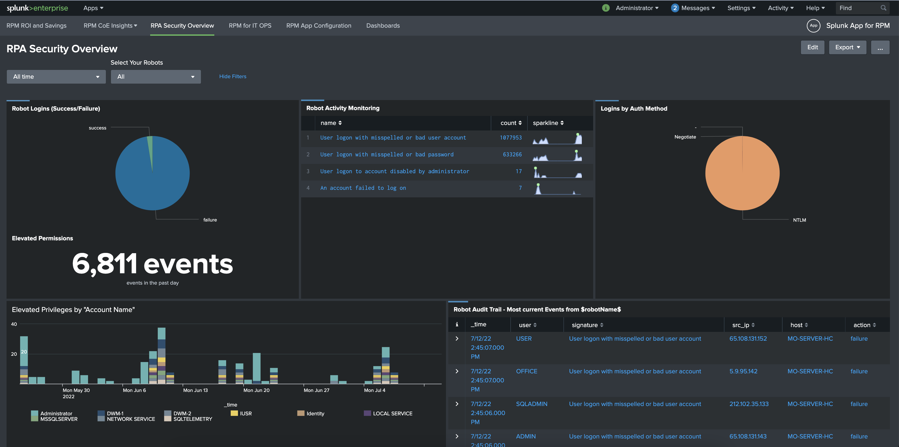
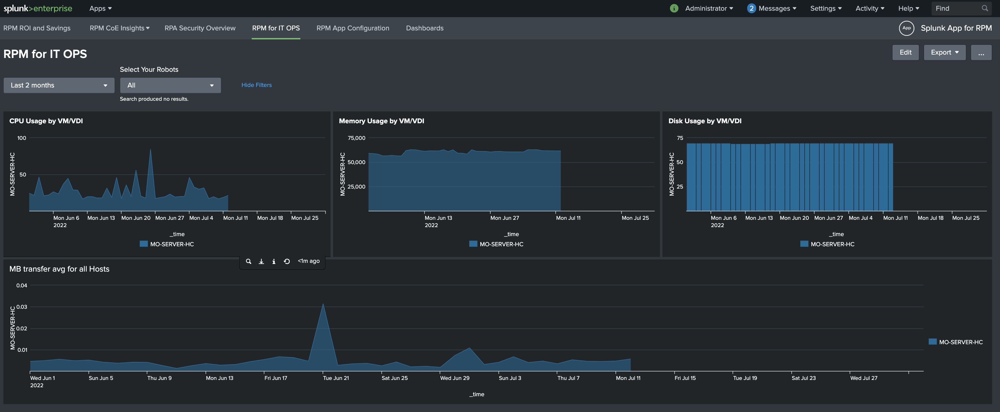

# RPM App for Splunk (Robotic Process Monitoring) for RPA deployments

The RPM App for Splunk is a collection of Splunk Dashboards and Data Collection configurations.  The App also allows you to automate actions to the UiPath API based on data in a Splunk index.

This App is designed to provide quick out the box monitoring of RPA deployments.  The focus is to ensure Reliability, Performance, and Security for RPA deployments.  Within a few clicks any RPA admin, operator, or developer can remidate any error that impacts RPA automations.  Splunk allows you to corrilate Infrastructure, Authentication and Access with a UiPath deployment (Orchistrators, Robots, Queues, Jobs, and Tasks)

The Splunk App for Robotic Process Automation (RPM) is designed to work with the following data sources:

* [UiPath Webhook Configuration](./docs/uipath_webhooks_config.MD): UiPath webhook forwarding.
* [Splunk Windows Universal Forwarder](./docs/splunk_uf_windows.MD): Windows Security Logs.
* [Splunk File path Monitoring](./docs/splunk_uf_windows.MD): UiPath Orchestrator Logs of Robot Executions.

## Dashboard Instructions

### Installation

The RPM App for Splunk is available for download from [Splunkbase](https://splunkbase.splunk.com/app/6551/). For Splunk Cloud, refer to [Install apps in your Splunk Cloud deployment](https://docs.splunk.com/Documentation/SplunkCloud/latest/Admin/SelfServiceAppInstall). For non-Splunk Cloud deployments, refer to the standard methods for Splunk Add-on installs as documented for a [Single Server Install](http://docs.splunk.com/Documentation/AddOns/latest/Overview/Singleserverinstall) or a [Distributed Environment Install](http://docs.splunk.com/Documentation/AddOns/latest/Overview/Distributedinstall).

**This app should be installed on both your search head tier as well as your indexer tier.**

### Configuration

1. The RPM App for Splunk V1 uses a static index `uipath` which will need to be configured in Splunk Cloud or Splunk. 
2. The UiPath Webhook Configuration forwards UiPath events to a Splunk HEC Collector.  That will need to be configured on port :8088 as a data input in Splunk Cloud or Splunk Enterprise.
3. The Orchestrator path `[monitor://C:\Users\Administrator\AppData\Local\UiPath\Logs\*.log]` is the execution path for all Robot events. The 'sourcetype' should be set to 'uipath_logs' to match the extraction configuration within the App to have the JSON parse correctly.
1. Finally, the Windows `Security` logs should be configured to understand the Authentication and Access of the Robots. This requires the Splunk Universal Forwarder to be run on Robot Windows Machines (not just the Orchestrator).  NOTE: Other Authentications can be configured such as Active Directory to drive the Security Dashboards.  Splunk CIM compliant sources can populate the 'Authentication" datamodel which can be used by this App and Enterprise Security (SIEM).

### Configuration Validation

Once you have configure the 3 pieces above you can validate basic flow of data from UiPath to Splunk.  The first check is to validate the Universal Forwarders (UF) is communicating with your Splunk deployment.  You can run the search 'index=_internal' then look at the 'host' field.  Here you should see the hostname of your Orchestrator server.  A second check can be to search the 'uipath' index to see if the webhook data is being sent to Splunk.  This validates that the Webhook configuration is negitiatging SSL AND the HEC token created on the HTTP Event Collector is authenticating.

### Examples

  
Expand for screenshots

#### RPM CoE Insights
  

#### RPM CoE Insights 2

  

#### RPA ROI Dashboard

#### RPM Security Overview

#### RPM for ITOPS

## Support

Support for Splunk App for RPM is run through [GitHub Issues](https://github.com/splunk/splunk_app_for_rpm/issues). Please open a new issue for any support issues or for feature requests. You may also open a Pull Request if you'd like to contribute additional dashboards, eventtypes for webhooks, or enhancements you may have.
