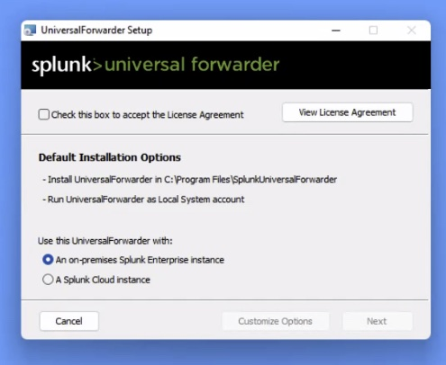
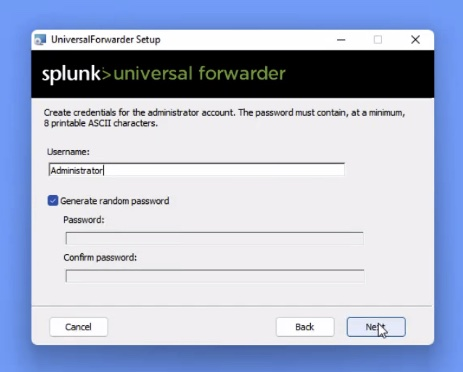

# Installing Splunk Universal Forwarder for Windows

Installing the Splunk Universal Forwarder (UF) allows Splunk to collect the UiPath Robot Exeuction logs in realtime.  The Splunk UF also allows you to collect Host vital resources such as CPU, Memory, Disk, and Network.  The Windows forwarder can also collect Security logs from Event Logs.

## Configuring The Splunk Universial Forwarder (UF) for Windows 

The Splunk Universal Forwarder is installed on the UiPath Orchestrator Server.  Here are step by step instructions to install the Univeral Forwarder and configure the required data inputs.

### Setting up Splunk Universal Forwarder for Windows

1. Download the Splunk Universal Forwarder for Windows.  The .msi makes the installation simple prompting you through `Next` buttons to create configurations.  
[Download Splunk Universal Forwarder for Windows](https://www.splunk.com/en_us/download/universal-forwarder.html)

2. Move the .msi to the Windows machine running UiPath Orchestrator.  Then click the installer to begin the Installation wizard which will walk you through the initial setup.
3. First accept the license agreement and select your Splunk deployment to forward data to.  Once you have done both, click `Next`.

4. Next enter the Administrator password for the Splunk Admin user.

5. Next is an optional configuration.  If you already have a Splunk deployment server to manage 100's/1000's of Universal Forwarders, you can point this newly installed UF to pull it's configuration from that server.  Those apps are installed as `deployment apps`.  If you are installing this Universal Forwarder and don't have an deployment server, you can leave the field blank and click `Next`.

1. Under the Application option, there should be an entry for `github_json`, however you may need to use the little search bar to find it.
1. For App Context, you'll want to select **Splunk App for GitHub**</li>
1. Next select the index created for this data. If none exist, create a new Index. Names like `github` or the like are recommended, depending on corporate naming conventions.
1. Lastly, click the Review button and confirm the data is correct and hit Submit.

Your token is now available to collect data, however we'll need to enable that token to allow Query String Authentication using that token. For this, you'll need command line access to your Splunk environment or be using a deployment server to deploy apps to Splunk.

To enable Query String Authentication, you'll need to update the `inputs.conf` file within the Splunk App for GitHub local directory. In that file, there will be a stanza with the name and value of the token you created. At the end of that stanza, you'll need to add `allowQueryStringAuth = true` and then restart Splunk. This is best done with the help of your Splunk team, so please reach out to them for assistance on this step.

### Setting Up GitHub Webhooks

Webhooks are a simple push mechanism that will send an event each time the webhook is triggered. Unfortunately, Webhooks are unique to each Organization and will need to be setup for each Org as desired. To do this, a user will need to be an Admin for the Org.

1. In your GitHub Organization Settings page, select Webhooks from the menu on the left.
1. On this page, you'll see all the existing Webhooks, click the **Add webhook** button to add one to send data to Splunk.
1. The Payload URL will be the Splunk HTTP Event Collector endpoint that was enabled above. It should look something like: `https://YOUR SPLUNK URL:8088/services/collector/raw?token=THE TOKEN FROM ABOVE`. The default port of 8088 may be different for your Splunk Environment, so please confirm the HEC port with your Splunk Admin team.
1. For Content Type, you'll want to select `application/json` as the best option.
1. You can choose to send just `push` events, All events, or manually select specific events from the list available. However, only some events have related Splunk eventtypes available to differentiate them within Splunk. See the table of available eventtypes below.
1. Once you click Add Webhook, a sample event will be triggered and it's status and response from the HTTP Event Collector should show below. Confirm that the response is OK. Otherwise triage as needed based on the HTTP Response provided.

Once that is complete and webhooks are triggering, you'll want to update the macro used for Webhook based dashboards. To do this:
1. In Splunk, under Settings > Advanced Search, you'll see an entry for Macros, click that.
1. There is a macro called `github_webhooks`, you'll need to update it to specify the Index used by the HTTP Event Collector token created earlier. Once saved, any dashboards that report on Webhook events should automatically start displaying data.

## Available Webhook Eventtypes
<table>
<tr>
<th>Splunk Eventtype</th>
<th>GitHub Webhook Event</th>
<th>Description</th>
</tr>
<tr>
<td>GitHub::Repo</td>
<td>Repositories</td>
<td>Repository created, deleted, archived, unarchived, publicized, privatized, edited, renamed, or transferred.</td>
</tr>
<tr>
<td>GitHub::Push</td>
<td>Pushes</td>
<td>Git push to a repository.</td>
</tr>
<tr>
<td>GitHub::PullRequest</td>
<td>Pull requests</td>
<td>Pull request opened, closed, reopened, edited, assigned, unassigned, review requested, review request removed, labeled, unlabeled, synchronized, ready for review, converted to draft, locked, unlocked, auto merge enabled, auto merge disabled, milestoned, or demilestoned.</td>
</tr>
<tr>
<td>GitHub::PullRequest::Review</td>
<td>Pull request reviews</td>
<td>Pull request review submitted, edited, or dismissed.</td>
</tr>
<tr>
<td>GitHub::CodeScanning</td>
<td>Code scanning alerts</td>
<td>Alerts identified by CodeQL and other 3rd party/OSS scanning tools.</td>
</tr>

</table>
