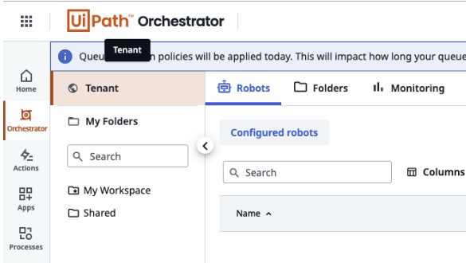

# UiPath Webhooks Configuration for the Splunk App for RPM (Robotic Process Monitoring)

## Prerequisites

- UiPath Cloud or UiPath on prem deployment with access to Admin
- Splunk Cloud instance (free 14 day trial available in minutes) OR Splunk Enterprise deployment

## Configuration

### Setting Up Splunk to Listen for Webhooks
1. Under Settings > Data Inputs, click **HTTP Event Collector**
1. Assuming HEC is enabled, click the **New Token** button
1. You can provide any name you want, however it is recommended to use something that will easily identify it like `uipath_webhooks` or similar based on your company's naming conventions, if they exist.
1. Unless required by your Splunk administrator, the rest of this page can be left as is and continue onto the next step.
1. You'll want to click `select` for Source Type, and a new selection box will appear below that.
1. Under the Application option, there should be an entry for `uipath_json`, however you may need to use the little search bar to find it.
1. For App Context, you'll want to select **Splunk App for RPM**</li>
1. Next select the index created for this data. If none exist, create a new Index. Names like `uipath` or the like are recommended, depending on corporate naming conventions.
1. Lastly, click the Review button and confirm the data is correct and hit Submit.

Your token is now available to collect data, however we'll need to enable that token to allow Query String Authentication using that token. For this, you'll need command line access to your Splunk environment or be using a deployment server to deploy apps to Splunk.

### Configuring UiPath Orchestrator webhooks
1. First, log into your UiPath Orchestrator and find your `Tenant` to configure the webhook in.

