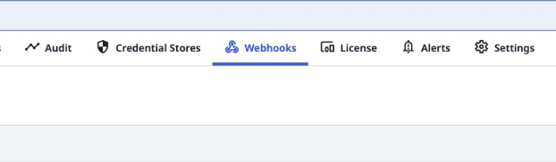
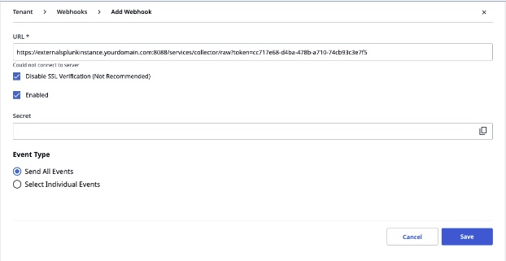

# UiPath Webhooks Configuration for the Splunk App for RPM (Robotic Process Monitoring)

## Prerequisites

- UiPath Cloud or UiPath on prem deployment with access to Admin
- Splunk Cloud instance (free 14 day trial available in minutes) OR Splunk Enterprise deployment

## Configuration

### Setting Up Splunk to Listen for Webhooks
1. Under Settings > Data Inputs, click **HTTP Event Collector**
1. Assuming HEC is enabled, click the **New Token** button
1. You can provide any name you want, however it is recommended to use something that will easily identify it like `uipath_webhooks` or similar based on your company's naming conventions, if they exist.
1. Unless required by your Splunk administrator, the rest of this page can be left as is and continue onto the next step.
1. You'll want to click `select` for Source Type, and a new selection box will appear below that.
1. Under the Application option, there should be an entry for `uipath`, however you may need to use the little search bar to find it.
1. For App Context, you'll want to select **RPM App for Splunk**</li>
1. Next select the index created for this data. If none exist, create a new Index. Names like `uipath` or the like are recommended, depending on corporate naming conventions.
1. Lastly, click the Review button and confirm the data is correct and hit Submit.

Your token is now available to collect data, however we'll need to enable that token to allow Query String Authentication using that token. For this, you'll need command line access to your Splunk environment or be using a deployment server to deploy apps to Splunk.

### Configuring UiPath Orchestrator webhooks

1. First, log into your UiPath Orchestrator and find your `Tenant` to configure the webhook in.

2. Secondly, lets click on the `Webhooks` option within the Tenant.  This will allow us to configure the Splunk HTTP Event Collector (HEC) as the HTTPS endpoint for the UiPath webhooks.

3. Lastly, lets input the Splunk HEC URL to stream events from UiPath to Splunk for indexing.  There is a special configuration to accept the Splunk HEC Auth token in the query string.  Which will be covered in the next steap.  Make sure to click the `Disable SSL Verification` since we are using self sign SSL certificates.  Also, make sure to select `Send All Events` in UiPath.

### Considerations and Validations ###

The webhook at Splunk conifiguration above will establish and SSL connection between the UiPath Orchestrator leader and the Splunk HEC endpoint.  Here are some considerations.

1. Do you have network and firewall / security group support?  Port 8088 is used as the destination port to the HEC endpoint from the UiPath Orchestrator.  NAT/RNAT rules may be needed.  Relaxing outbound firewalls and forward proxies may be needed.  For inbound, make sure to only allow connections from trusted UiPath IP addresses to filter out other clients.
2. SSL Certificates.  Although the self signed certificates will negoitate highest ciphers and version of the TLS protocol, using SSL Certificates signed by your CA is best practice and required for proper SSL handshakes.  If this is configured, you can uncheck the `Disable SSL Verification`.  
3. Validation.  You should now see UiPath events in your `uipath` index.  You can check by running the Splunk search `index=uipath` and running a simple automation in UiPath.

## UiPath Webhook Data
<table>
<tr>
<th>UiPath EventType</th>
<th>Uipath Webhook Event</th>
<th>Description</th>
</tr>
<tr>
<td>Jobs</td>
<td>Automations Job</td>
<td>successful, stopped, and faulted</td>
</tr>
<tr>
<td>Queues</td>
<td>Queued Automation Jobs</td>
<td>The auto-incremented row ID of the queue item in the Orchestrator database</td>
</tr>
<tr>
<td>Robot Logs</td>
<td>Logs from the Robot processing the Automations</td>
<td>i.e. Machine Id - The Id of the machine (robot) that generated the log message.</td>
</tr>
</table>
